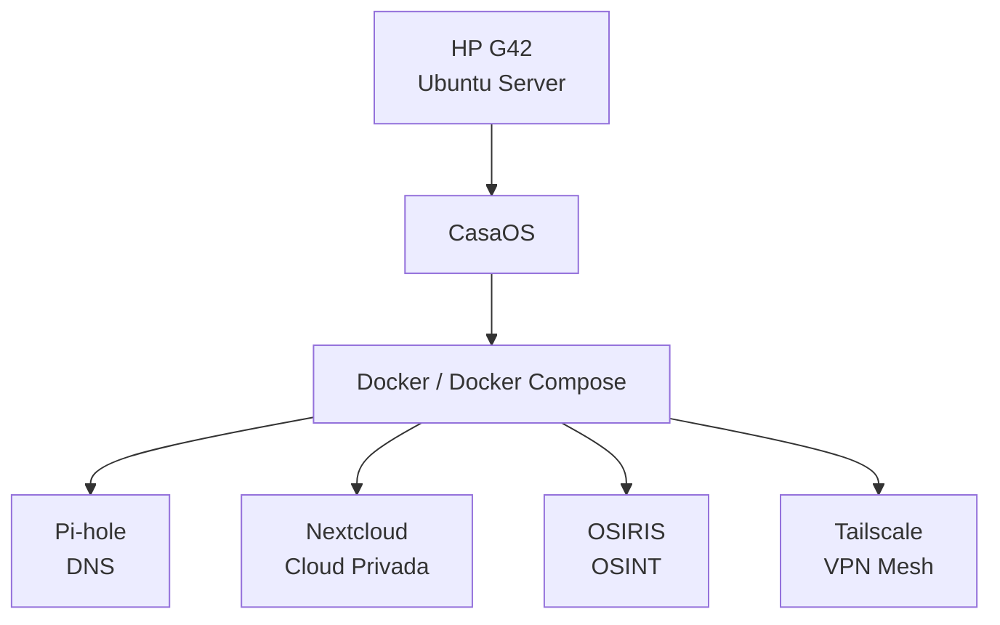

# 🏠 Homelab de Infraestrutura, Redes e Segurança da Informação

Ambiente pessoal dedicado ao estudo prático de **Administração de Sistemas Linux, Redes, Docker, Virtualização e Segurança da Informação**.

Este laboratório foi construído utilizando hardware reaproveitado e tem como objetivo desenvolver experiência prática em infraestrutura, resolvendo problemas reais encontrados durante a implantação e manutenção dos serviços.

---

## 📌 Visão Geral

O ambiente é executado em um notebook **HP G42** rodando **Ubuntu Server**, utilizando **CasaOS** como interface de gerenciamento e **Docker** para hospedar aplicações em containers.

### 💻 Hardware

- Notebook HP G42
- Intel® Core™ i5 de 1ª geração
- 8 GB de RAM
- SSD para o sistema
- HD externo USB para armazenamento
- Ubuntu Server LTS

---

## 🏗️ Arquitetura

---

## 🚀 Serviços

| Serviço | Descrição |
|----------|-----------|
| 🛡️ Pi-hole | Servidor DNS com bloqueio de anúncios, trackers e domínios maliciosos. |
| ☁️ Nextcloud | Plataforma de armazenamento em nuvem privada (Self-hosted). |
| 🔍 OSIRIS | Plataforma para estudos e análises de OSINT. |
| 🔐 Tailscale | VPN Mesh para acesso remoto seguro ao laboratório. |
| 📦 Docker | Plataforma de containerização dos serviços. |
| ⚙️ Docker Compose | Gerenciamento e orquestração dos containers. |
| 🖥️ CasaOS | Interface web para gerenciamento do servidor e aplicações. |

---

## 🔧 Desafios Técnicos Resolvidos

Durante o desenvolvimento deste laboratório foram solucionados diversos problemas reais de infraestrutura.

### Conflito da Porta 53

O serviço **systemd-resolved** ocupava a porta utilizada pelo Pi-hole.

**Solução**

- Desativação do DNS Stub Listener
- Reconfiguração do resolved.conf
- Integração correta do Pi-hole como DNS principal

---

### Blocklists Avançadas (~5kk)

Implementação de múltiplas listas de bloqueio para aumentar a proteção da rede.

Incluindo:

- StevenBlack
- HaGeZi Pro
- HaGeZi Pro+
- HaGeZi TIF
- Anti Scam
- Anti Malware

---

### Problemas com HD USB

O armazenamento externo apresentava instabilidade devido ao driver **USB Attached SCSI (UAS)**.

**Solução**

Aplicação de **USB Quirks** no kernel para forçar o modo BOT, eliminando desconexões.

---

### Configuração de Rede

Após reinicializações o servidor perdia conectividade.

**Solução**

Correção da configuração do **Netplan** e do DHCP.

---

### Docker Networking

Durante a implantação dos containers ocorreram conflitos de portas e redes.

Foram realizados:

- Ajuste das redes Docker
- Revisão das dependências entre containers

---

### Compatibilidade de Hardware

Foi identificado que o Intel Core i5 de primeira geração **não possui suporte às instruções AVX**, impossibilitando a execução do MongoDB 6.x (dependência do UniFi Controller).

O caso foi documentado como estudo de compatibilidade entre hardware legado e software moderno.

---

##  Conhecimentos Aplicados

- Administração Linux
- Redes de Computadores
- DNS
- DHCP
- VPN
- Docker
- Docker Compose
- CasaOS
- Troubleshooting
- Segurança da Informação
- Hardening básico
- OSINT
- Infraestrutura Self-hosted

---

##  Tecnologias

- Ubuntu Server
- CasaOS
- Docker
- Docker Compose
- Pi-hole
- Tailscale
- Nextcloud
- Netplan
- Linux
- Git
- GitHub

---

##  Objetivo

Este homelab tem como finalidade servir como ambiente de estudos, testes e documentação prática dos conhecimentos adquiridos em cursos, certificações e projetos pessoais.

Além de consolidar conceitos de infraestrutura, o projeto também funciona como **portfólio técnico**, demonstrando habilidades em administração de sistemas, redes e Segurança da Informação.

---

## 👨‍💻 Autor

**Esttevão Pereira Silva**

Estudante de Segurança da Informação

- 💼 LinkedIn: https://www.linkedin.com/in/esttev%C3%A3o-pereira-silva-143848375/
- 📧 Email: esttevaopereira1@gmail.com

---

> Projeto em constante evolução. Novos serviços, documentações e estudos serão adicionados conforme o laboratório cresce.
